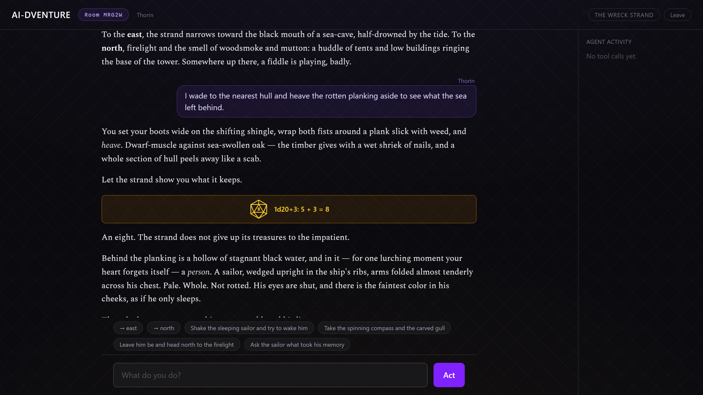
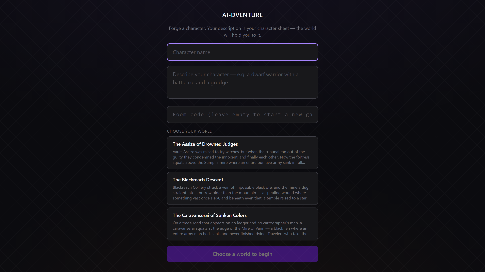
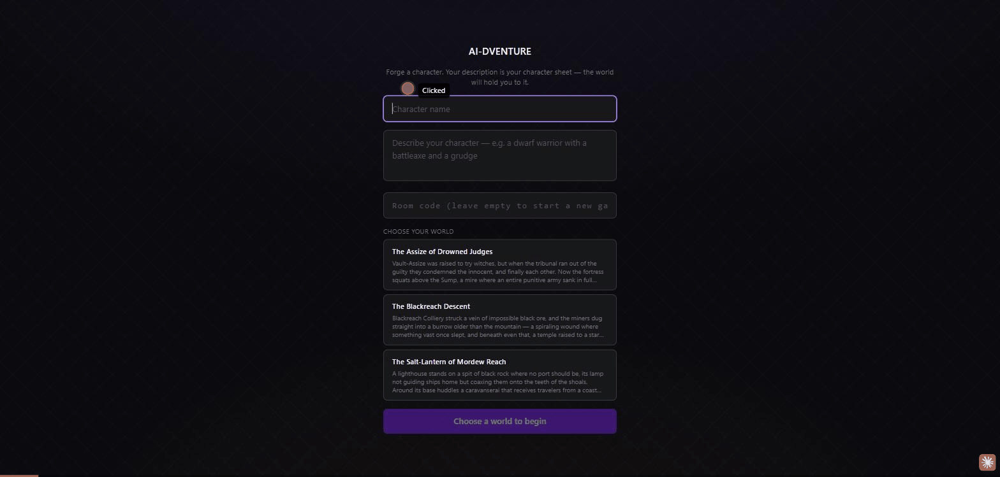

# AI-dventure

A multiplayer, grimdark text adventure where Claude is the game master. Players forge characters, pick a freshly generated world, and share one live story — dice rolls, hidden secrets, party movement and all.

Built as a working showcase of AI-assisted development: a human directs, reviews, and owns every change; Claude (via [Claude Code](https://claude.com/claude-code)) does the building. The checked-in `CLAUDE.md`, the eval suite, and the project skill under `.claude/skills/` are part of that workflow, not an afterthought.



<details>
<summary>More: the world-choice menu, and an animated demo of a full turn (9&nbsp;MB GIF)</summary>

Every new game picks from a menu of Claude-generated worlds, kept ready in a pool:



A full session — forge a character, pick a world, the opening scene streams in, and a dice roll pauses the turn until the player clicks:



</details>

## How the AI works

**Claude as game master, tools as the only hands.** Each turn runs an agent loop (`backend/app/agent.py`): Claude streams narration and calls tools mid-turn. Claude never touches the database directly — all world state flows through **MCP (Model Context Protocol)** servers spawned as stdio subprocesses:

- `sqlite_server` — locations, exits, NPCs, party position, and pre-authored secrets. The only thing allowed to mutate world state during play.
- `dice_server` — every roll is real, parsed dice notation (`2d6+3`), rolled in code. Claude narrates numbers it was given, never numbers it invented.

**Structured output contract.** A turn's response is assembled from sources with different trust levels: the narrative is Claude's streamed text; `location`/`exits`/`visible_npcs` are re-read from SQLite after the turn (never trusted from the model, so narrated state can't drift from persisted state); suggested actions arrive through a `strict: true` tool call, so their shape is API-guaranteed. Schema violations degrade gracefully rather than crash the turn.

**Pre-authored secrets.** World generation writes hidden facts (weak spots, hidden doors, puzzle solutions) into SQLite at generation time. During play they're *retrieved* through tool results and enforced as ground truth — never re-derived from the narrative, so the world can't quietly rewrite its own rules.

**Generated worlds, ready to play.** A background task keeps a pool of Claude-generated worlds (title, concept, location graph, NPCs, secrets — validated against a schema before insert). New games pick from the pool's menu; an empty pool generates on demand and, failing that, falls back to a hand-authored world.

**Generated backdrops.** Each world also gets its own background art at generation time, shown at low opacity in-game and on the world-choice cards. Three modes, switchable live from the in-app Options menu (a server-global setting — art generates into the shared pool): Claude *draws* an atmospheric SVG scene from the world's own concept (the default — no extra setup), Grok Imagine renders it via the xAI API (`GROK_KEY`), or a local Stable Diffusion server does (`SD_WEBUI_URL`, A1111 API). Raster modes degrade to the SVG mode on any failure, and everything stored is validated first — SVGs pass an active-content sanitizer, rasters get mime-sniffed and size-capped.

**Players hold the dice.** When Claude calls the roll tool, the turn blocks server-side until the acting player clicks the die (with a timeout backstop so nobody can deadlock the room). The result is broadcast, animated, and persisted into the game log exactly where it happened in the narration.

**Prompt-injection defenses.** Player text influences the model, so the model's tool arguments are not trusted: `game_id` is pinned server-side and entity ids are scoped to the game's own world at the single tool-dispatch point (`scope_tool_args`). Player-authored strings are sanitized so the conversation's server-voice channels (`[Name]:` attribution, `[System note: ...]`) can't be forged, and the one unattributed message channel accepts only the fixed opening line. See `backend/tests/test_injection.py` for the contract.

**Characters you keep.** A per-browser roster: characters save automatically when you create or join, reappear as one-tap chips on the join screen, and names stay unique (delete before reuse). No accounts — identity lives in localStorage, same as sessions.

**Multiplayer without a message broker.** A room code is the capability. Every browser subscribes to one SSE stream per room; turn events (streamed narration, tool activity, dice, joins/leaves) fan out to actor and spectators alike. Turns are first-come-wins — a second submitter gets a 409, not a queue. Games, history, and logs live in SQLite and survive restarts, including mid-conversation model content blocks serialized back to the API's input shape.

## Stack

| Layer | Tech |
|---|---|
| Backend | Python, FastAPI, Anthropic SDK, MCP Python SDK, SQLite |
| Frontend | React, TypeScript, Vite, Tailwind CSS |
| Model | Claude Opus 4.8 (game master and world generation) |
| Tooling | uv, pytest, vitest, oxlint |

## Running it

Requires `ANTHROPIC_API_KEY` (in the environment, or in a `.env` at the repo root).

```bash
# Backend (from backend/)
uv run fastapi dev

# Frontend (from frontend/)  — proxies /api to the backend
npm install
npm run dev            # http://localhost:5173
```

The first game on a fresh database generates its world on demand (~a minute); after that the pool keeps worlds ready.

## Testing

Three tiers, deliberately separated:

- **Unit tests** — pure logic with nothing spun up: world-payload validation, response-schema coercion, the injection-scoping guard, and the frontend's game logic (`npm test`, vitest).
- **Integration tests** — the real FastAPI app under `TestClient` with real MCP subprocesses and an isolated per-test SQLite file; only the model call is faked. Rooms, turn locking, persistence across restarts, dice wait/release, leave semantics, world choice, cleanup. The agent loop's streaming internals (paragraph breaks, log splitting around rolls, scope pinning) run against a faked Anthropic stream.
- **Evals** — LLM-as-judge tests for tone consistency, character-class enforcement, and world-generation quality. They cost real tokens, so they're marked `eval` and excluded from a plain `pytest` run — even with an API key present.

```bash
# Backend: unit + integration
cd backend && uv run pytest

# Backend: evals (deliberate, costs tokens, needs ANTHROPIC_API_KEY)
cd backend && uv run pytest -m eval

# Frontend
cd frontend && npm test
```
